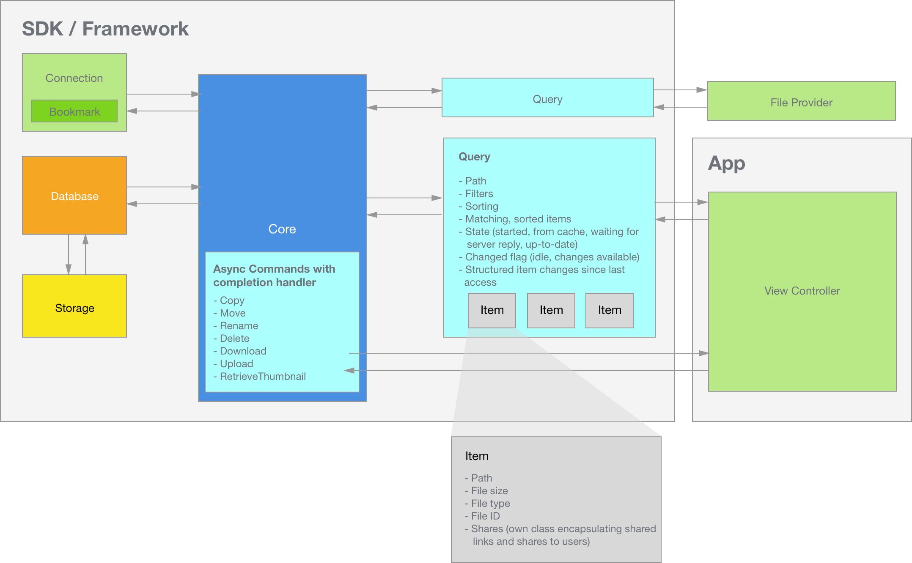
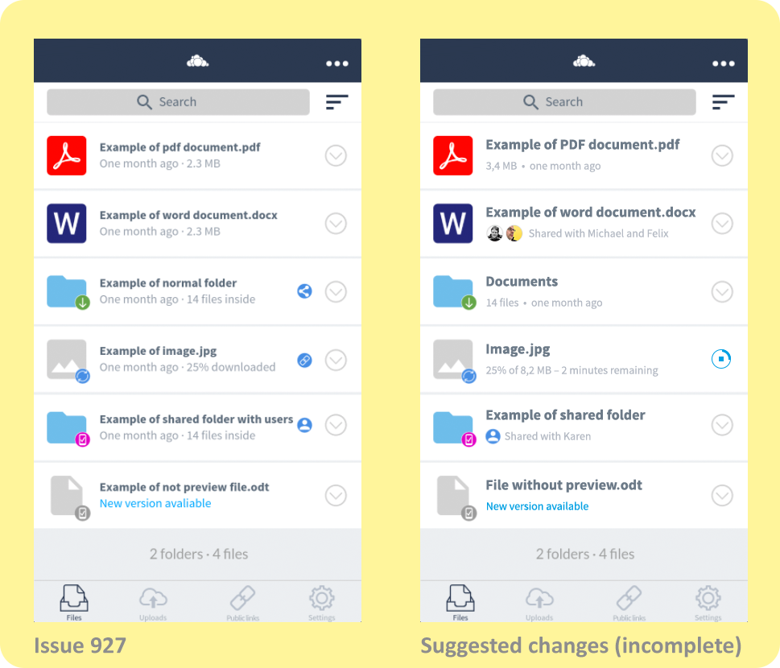
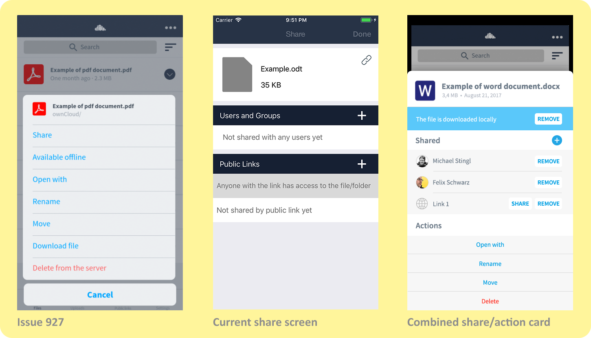

# ownCloud iOS: A Fresh Start
by Felix Schwarz for ownCloud GmbH

## Table of contents
1. [A fresh start](#a-fresh-start)
2. [Proposal of a modern architecture](#proposal-of-a-modern-architecture)
    1. [The SDK architecture](#the-sdk-architecture)
    2. [Benefits](#benefits)
3. [Strategic goals](#strategic-goals)
4. [User Interface And User Experience](#user-interface-and-user-experience)
    1. [File List](#file-list)
    2. [Sharing / Actions](#sharing-actions)

## A fresh start
This document explores ideas and concepts for a rewrite of the ownCloud client for iOS.

## Proposal of a modern architecture
The new architecture I'd like to propose consists of two parts:

- **a new SDK**: a new SDK that offers a high-level interface, making it easy to build user interfaces and other functionality on top of it. Apps using the SDK should be able to pick the components they want to use - and thereby the amount of low-level details they want to/have to handle themselves.

- **a new app**: a new client app that takes full advantage of the high-level interfaces of the new SDK to implement a dynamic user interface that fits in well with the current iOS landscape and provides room to grow.

### The SDK architecture

The iOS SDK comes as a framework that is easy to integrate and encapsulates all needed code and resources.

- **Bookmark** objects contain the URL of an ownCloud server and access to the credentials stored in the iOS keychain. Bookmark objects are used to initialize a Core (see below). Bookmark objects can also be serialized for permanently storing references to a user's servers.

- **Connection** objects are responsible for forming HTTP(S) and WebDAV requests, sending them to the ownCloud server (identified by a bookmark), parsing the result and returning the result back to the Core. It also is responsible for establishing the authenticity of the server and notifying the Core about any issues it finds. In case of issues, the Core can consult with a delegate (usually implemented by the app using the SDK) and then instruct the Connection on whether to proceed or not.

- **Database** objects are responsible for storing cached information on disk and providing the Core access to it. It is also responsible for storing local copies of files. On disk, one directory is used for every database - and one database is used per bookmark. This way, removing all resources related to a server is as easy as deleting its database directory.

- **Query** objects provide an interface between the Core and apps. They encapsulate a long-running query consisting of
    - the path of the file or directory the query targets
    - a customizable filter that limits which items are returned (can be used to implement search)
    - an array holding all found items ("Found Items")
    - an optional sorting block that defines the order of the Found Items
    - the request's state: "idle" (no changes), "updating" (results come from the database, but a request has also been sent to the server - updates possible at any time) or "updates available" (query owner should request a list of changes / all items and update the UI accordingly)
    - an array holding all changes since the query owner last requested them, in structured form suitable for implementing animated UIs

- **Item** objects encapsulate metadata, status information and shares (see next point) about directories and files.

- **Share** objects encapsulate all metadata of shared links, users with whom a file/directory was shared as well as users by whom a file/directory was shared.

- **Commands** are methods provided by the Core to asynchronously perform file operations such as copy, move, rename, delete, download, upload and retrieving thumbnails. Apps pass in Item objects and a completion handler. When the file operation has finished, the completion handler is called and related queries updated accordingly.

- **Core** objects tie everything together. When a new query is added to a core, it consults the Database for immediate results - and makes requests to the server using the Connection as needed.

    When the Connection returns results, the Core runs through all running Queries, checks if the result relates to them, updates the Query's items as necessary and finally notifies the Query owner that results have changed.

    It also coalesces changes, so that when a query's owner gets around to fetching the changes, the change set is as compact as possible.

### Benefits
The architecture proposed above offers a lot of benefits, some of which I'd like to highlight here:

- **Decoupled UI and core logic:** UI code can use high-level abstractions and can be mostly limited to render the information contained in the Items and Share objects. It no longer has to worry about any low-level details like keeping track of the database.

- **Dynamic updates:** Long-running queries provide an efficient way of keeping the information presented throughout the entire user interface consistent: any change made by any part of the app is immediately reflected in the results of a query, prompting all relevant parts of the UI to update to reflect the changes.

    Delete a file in a folder, navigate back to the parent folder - and see the number of files shown for that directory has already been updated to reflect the change. No extra code required.

- **Push-ready:** If future versions of the ownCloud server add support for push updates, it will be a natural fit for this architecture. Changes received by push would be handled by the core and forwarded to the UI and extensions via queries.

- **Performance:** A key feature of this architecture is that notifications about changes are limited to "updates are available", so that the computation of changes can be delayed until they're actually requested. For example, updates could be pushed to queries as they are parsed. But there won't be 1000 updates to the UI for 1000 changes. This way, results can be displayed immediately while the UI stays responsive and fast.

- **Multi-server support:** There is no global state. All information is encapsulated into instances and cleanly separated. This makes supporting and staying connected to more than one server relatively easy.

- **Performance QA:** Xcode's XCTest provides support for performance tests and can keep track of the results relative to a baseline value. If performance differs from the baseline by more than a user-defined threshold, the test will fail and draw attention to itself.

  Using the proposed architecture, writing performance tests is relatively easy since the UI then is only a thin layer on top of the SDK that is unlikely to cause performance regressions.

## Strategic goals
A rewrite is a great opportunity to build a new, solid foundation and achieve strategic goals such as:

- **Good platform citizen**: fit in with the rest of the system by using native UI elements where available, follow design patterns typical for the platform and pick icons that match the look of the operating system.

- **Adaptive UI**: use of *Adaptive UI* techniques such as size classes, trait collections and asset catalogs to provide a rich user interface for all screen sizes and iPad multitasking.

- **Integration**: integration with iOS through extensions (incl. an iOS 11 file provider extension)

- **Modularity**: components and subsystems within the SDK and the app should be kept as isolated as possible for reduced internal complexity, improved testability, maintainability and stability.

- **No dependencies**: third-party libraries are convenient, but add weight to the project, can quickly turn into tech debt or require a lot of effort to fix issues inside them. They should therefore be avoided where possible.

- **Language stability and reach**: Objective-C is a mature, "finished" language with fast compile times and all tools available for development ("language stability"). It can also be mixed with or used from other languages like C++ and Swift ("reach"). It should therefore be used exclusively for the iOS SDK and - in order to move fast and keep the app size small - I'd also recommend using it exclusively for the app.

## User Interface And User Experience Ideas

### File List

Based on [Issue 927](https://github.com/owncloud/ios/issues/927) (pictured on the left), here's what a future file list could look like:

- **Numeric content first:** file sizes and the number of files in a folder are easier to read at the start of the line, especially when dates are shown in relative rather than absolute formatting

- **Sharing icons:** replacement of all sharing icons with a human-readable description of the sharing status in the description line. For users with an avatar (or [Gravatar](https://en.gravatar.com/)), the avatars could be displayed inline. Where no avatar is available, a placeholder icon could be used.

- **Download status:** for files that are currently downloading, the action button of the entry should be a combined circular progress/stop icon. This makes currently downloading files easy to find and cancel.

    In addition, the progress and estimated time remaining could be shown in the description line.

- **Typography:** for best readability of the file list, a bigger font size could be used for file and directory names.

- **3D touch / Peek & Pop:** 3D touching an item brings up a combined share/action card (detailed below) via the standard iOS peek & pop mechanism. This way, users with devices supporting 3D touch can quickly glance at details for a file.

    This may be especially useful for files with long names - or for glancing at the absolute date of a file.

### Sharing / Actions

I'd like to suggest a combined share/action card (pictured on the right), that replaces the planned action sheet and existing share screen and provides - from top to bottom - the following information and actions:

- **File metadata:** file name, file size and absolute file date are displayed in the header. Long file names are broken into multiple lines and displayed in their entirety.

- **Storage status:** the current status (downloaded/available offline - or not) of the file in plain text. The button following that provides actions like "Download" or "Remove", depending on its current local status. The background color changes, depending on the status.

- **Shared:** displays the current sharing status
    - pressing the "+" lets the user choose between creating a new link or adding a user

    - for users with whom the file is shared, the option to remove the user is provided

    - for links, a share button (invoking the standard iOS share sheet) and a remove button is shown

    - additional information like expiration dates or expiration status could be shown in a second line for each entry

- **Actions:** List of actions not already covered above.
